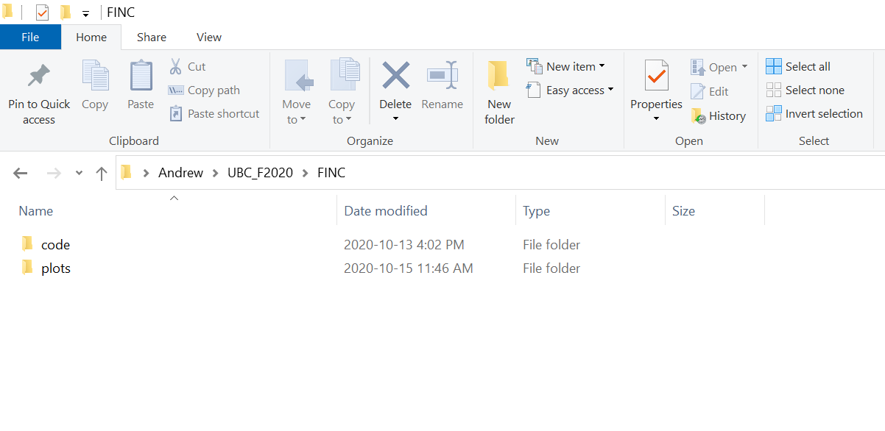
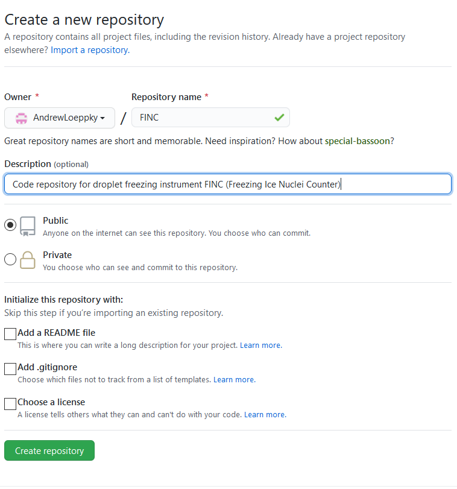
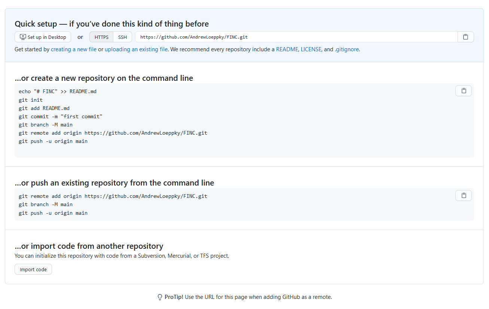
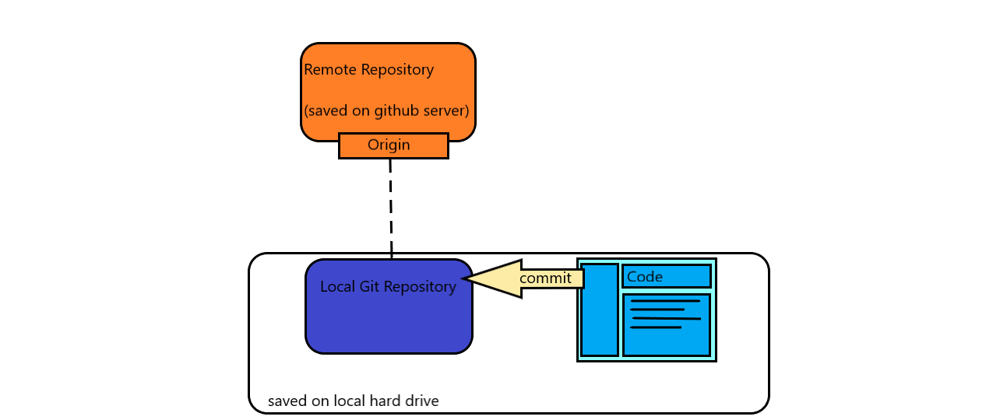
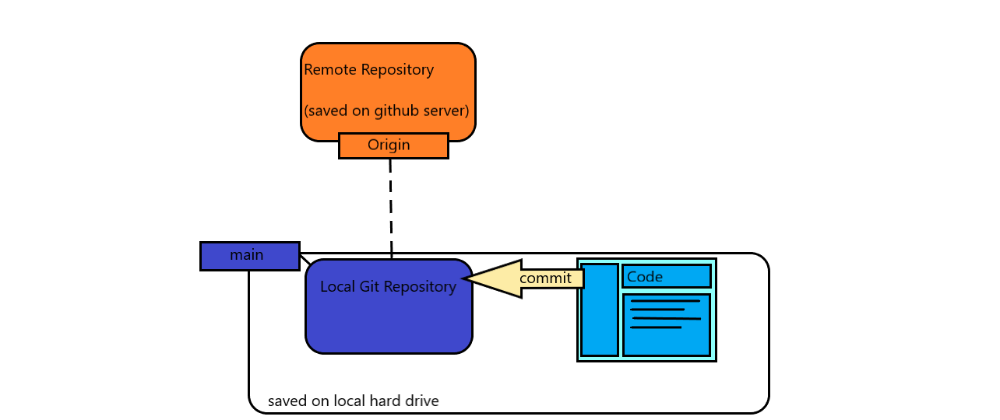
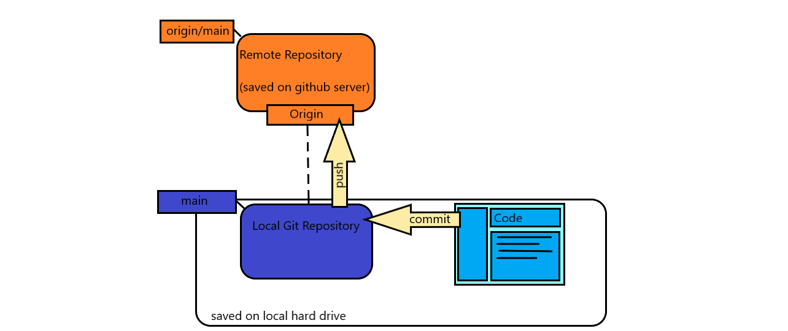

# Case Study - A Grad Student Uses Git

Let's now use our git skills to an application typical in research/writing of a grad thesis. Our task is to maintain and develop the code base for a scientific instrument called FINC (Freezing Ice Nuclei Counter) used for cloud-aerosol research. Currently, the code consists of several MATLAB functions which work together to run the instrument's micro-computer and produce some standard output data/plots. We will need to add to/modify this code to make it suit our particular purposes, being careful never to dismantle the original functionality or prevent us from actually performing experiments.

## Creating a Local Repo for FINC

First, gather all necessary code and save it in a folder. Best practice is to separate code from data (i.e. I created a folder called `FINC` with subfolders `code` and `plots`). Git/Github are only meant for storing the code itself, and Github has a 100MB per file size limit. The idea is that if we maintain our repository properly, data files and plots are easily reproducible from the source code.



Open a shell and ```cd``` to the folder where we are keeping our code. Type ```ls``` to see the contents of the folder

```bash
$ cd .\UBC_F2020\FINC\code\

$ ls


    Directory: C:\Users\Owner\UBC_F2020\FINC\code


Mode                 LastWriteTime         Length Name
----                 -------------         ------ ----
-a----        2020-10-08   2:29 PM          16232 autowell.m
-a----        2020-10-13   1:22 PM             53 wellinspector.m
-a----        2020-10-08   3:43 PM            916 manualAlign.m


$
```

Now type ```git init``` to initialize a .git folder in this directory. If you have not yet installed git on your computer, click [here](https://git-scm.com/book/en/v2/Getting-Started-Installing-Git).

```
$ git init
Initialized empty Git repository in C:/Users/Owner/UBC_F2020/FINC/code/.git/
```

Git is now able to track any changes that happen within the ```code``` folder. However, at present the repository is currently empty. We can see this by doing:

```
$ git status
On branch main

No commits yet

Untracked files:
  (use "git add <file>..." to include in what will be committed)
        autowell.m
        manualalign.m
        wellinspector.m

nothing added to commit but untracked files present (use "git add" to track)
```

*Committing* code to the repository happens in two steps. First use ```git add``` to move a file/files to the *staging area*:

```
$ git add autowell.m
$ git add manualalign.m
$ git add wellinspector.m
```

Or, if you simply want to stage all the files in the directory, use:

```
$ git add .
```

Check that it worked with another ```git status```:

```
> git status
On branch main

No commits yet

Changes to be committed:
  (use "git rm --cached <file>..." to unstage)
        new file:   autowell.m
        new file:   manualalign.m
        new file:   wellinspector.m
```

If we are happy with the files in the staging area, we can now commit them to git and include a *commit message*. For an initial commit to a new repository, the traditional message is "initial commit."

```
$ git commit -m 'initial commit'
[master (root-commit) 5785b2e] my commit message
 3 files changed, 0 insertions(+), 0 deletions(-)
 create mode 100644 autowell
 create mode 100644 manualalign.m
 creade mode 100644 wellinspector.m
 ```

Once again we can inspect our repository with ```git status```:

```
$ git status
On branch main
nothing to commit, working tree clean
```

## Creating a Remote Repo

Pushing code to a remote repository is a good idea for two reasons: One, our project gets saved in the cloud, so it's protected in case your computer is lost/broken; and two, remote repos like github are built for developing code in teams, so n...

Note, like all things programming-related, there are a number of ways to initialize a repository. Follow the instructions here as closely as possible for best results

Log into your github account. If you havent made one yet, follow the instructions [here](url) to do so. Navigate to **Repositories** $\rightarrow$ **New**. Give your online repo a name and short description, then press **Create repository**



We are now greeted with an empty online repo, and given a number of options to fill it. 



We shall choose the third option. This is actually a fairly complex operation condensed into only three commands, so let's discuss each in turn. In your shell, type:

```
$ git remote add origin https://github.com/AndrewLoeppky/FINC.git
```

This tells git to associate our *local repo* (i.e. the .git folder we created, saved on our computer's hard drive) with a *remote* (A repository on github's server, accessed via the URL provided).

"Origin" is a name we assign for our machine to refer to the new remote repository. You can choose to name your remote anything you want (i.e. ```git remote add spam https://github.com/AndrewLoeppky/FINC.git``` would name the remote "spam") but the convention is to use "origin" if you are the primary owner of the online repository. The current configuration looks something like this:



Next, we do:

```
$ git branch -M main
```

Here we tell git to create a branch and name the branch "main." *Branches* are subdivisions of a repository, and are an incredibly valuable feature for this type of application. Recall that we need to always maintain a working version of the code such that the instrument will run, but also develop new functions to improve behavior. We can do this by splitting our code base into a *working branch* (by convention named "main") that only contains complete/fully functional code, and one or more *development branches*, which can be used to experiment without worrying about crippling the instrument. More on this later.



```
$ git push -u origin main
```

*Push* means sending code from a local repo to a remote. Note you can only push code to remotes that you own.

