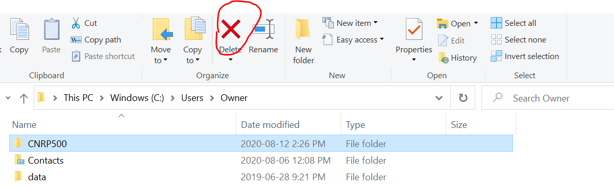
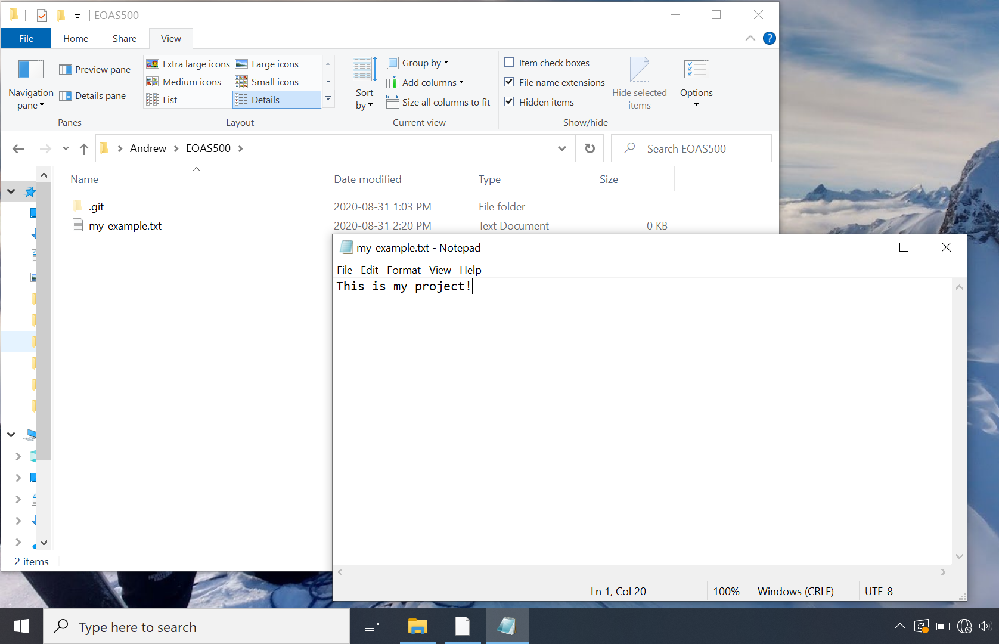
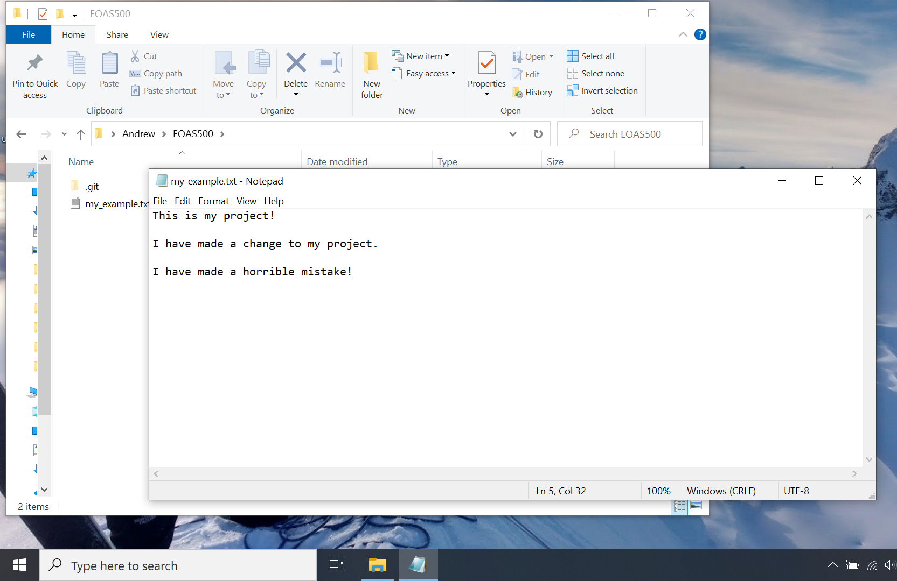

# Powershell, Git and System Administration Crash Course

---

## Intro

The purpose of this tutorial is to aid students in EOAS graduate studies who lack formal background in computer science by introducing several extremely helpful tools used for developing code keeping files organized.

There are two parts to the tutorial: Part 1 involves learning to navigate your computer via a command line interface like **Windows Powershell** or **Bash**. This is a useful skill for any programmer to have, and is essential for installing and using many computational tools available to scientists for data analysis.

Part 2 involves setting up and using **Git** to track changes to files and using **Github** as a remote file backup system, to prevent the dreaded "computer crashes the week before a thesis defense, leaving you with nothing" scenario.

## Part 1: Using a Shell

Using a shell is a great skill for aspiring scientific programmers to develop. In the past, a shell with a *command line interface* was the only way to interact with a computer, entering commands line by line into a *prompt*. Nowadays, operating systems and most production-grade programs/applications include a *graphical user interface (GUI),* which is the collection of mouse buttons, pull down menus, text boxes, etc. that users use to interact with a program. As scientists, oftentimes the tools we need to access (or write ourselves) for analyzing data are limited to fairly rudimentary inputs and outputs on the command line, as GUIs are rather labour intensive to develop. Since we would rather focus on solving scientific problems instead of learning the complicated art of "front end programming" (i.e. developing graphical user interfaces), a small investment in time learning to use a shell for running programs will pay huge dividends, and grant us easier access to a huge array of computational tools for doing science.

### What is a Shell?

A shell is just a program that has access to your operating system's services. Shells can run other programs, open and save files, or install programs on your machine. Often we can accomplish the same tasks by clicking around the start menu/file explorer (windows) or dashboard/finder (mac), but as we progress as scientific programmers, we will find increasingly that we can do things more efficiently typing commands into a shell versus using the GUI. Some tasks can only be accomplished via the command line in a shell. Mac and Linux computers typically use BASH as the default shell, and Windows computers typically use Windows Terminal or Windows Powershell. Many other shell programs exist for various operating systems, and can be installed to suit individual preference. Many commands work across most shells, but there are several things that work in BASH that will not work in Powershell and vice-versa.

### Using a Command Line Interface

Begin by opening your shell program of choice (Powershell/Bash/whatever). You should see some preliminary text, followed by a blinking cursor waiting for input. Depending on your choice of shell and the exact configuration, the prompt may look something like:

```powershell
$
```

or

```powershell
>
```

or

```powershell
C:\folder1\folder2>
```

For the purposes of most tutorials and documentation involving shell commands, the ```$``` command prompt is assumed, regardless of what yours actually looks like. Do not type the "$" sign as part of your input.

First, let's orient ourselves within our computer's folder tree. Type the following into the prompt and press ```enter```

```powershell
$ pwd
```

```pwd``` stands for "print working directory," which is the directory you are currently in. If you were to create or save a file right now, it would be saved in the working directory, unless otherwise specified. You should now see something like:

```powershell
$ pwd

Path
----
C:\Users\Owner\Shell_Tutorial

$
```

Your working directory is printed to the screen and the prompt re-appears, ready for more input. You can move around your computer's folder tree using ```cd``` (change directory) followed by:

```$ cd my_folder``` $\rightarrow$ change into sub-directory named "my_folder"

```$ cd ..``` $\rightarrow$ go up one folder level (to the *parent directory* relative to your current folder)

```$ cd ~```  $\rightarrow$ go to the home directory

```$ mkdir my_folder``` $\rightarrow$ make a new directory called "my_folder" inside the current directory

you can also use ```ls``` to list all files contained within the current working directory and print them to the screen. The results will look something like this:

```powershell
$ ls

    Directory: C:\Users\Owner\my_folder


Mode                 LastWriteTime         Length Name
----                 -------------         ------ ----
d-----        2020-06-03   3:22 PM                file_1
d-----        2020-06-11   9:26 AM                file_2
d-----        2020-07-31  10:21 AM          sub_folder_1
```
### Exercise 1

Your task is to create a directory in which we will store all files, labs, assignments, etc. for EOAS500, using both file explorer and powershell. We will use this directory later in Exercise 2, where we will set up version control using **Git**.

#### PART 1: File Explorer

1) Open file explorer via **Start** $\rightarrow$ **File Explorer**
2) On the left hand side, select **Windows (C:)**, then **Users**, then **Owner**
3) Use the **New Folder** button to create a new folder and name it "EOAS500"
4) Double click on the folder to look inside it. Right now, it should be empty.
5) Click the $\uparrow$ button to navigate to the *parent directory* one level above the current working directory.

6) Now select the EOAS500 folder you just created and click the $\textcolor{red}{X}$ button to delete it. We will re-make it again shortly using powershell.


#### PART 2: Powershell

Let's perform the exact same operation using command line inputs from a shell. After each step, check file explorer to see the results displayed in the GUI.

1) Open powershell via **Start** $\rightarrow$ **Powershell**
2) Type:

   ```
   $ cd ~
   $ pwd
   ```

3) This will show you your working directory (some shell configurations will also show the working directory at each line as part of the prompt). Use ```cd ..``` and ```cd foldername``` (replace ```foldername``` with the folder you want to move into) to navigate to ```C:\Users\Owner```. Bonus: try using the ```tab``` key to autocomplete commands
4) Create a new directory called "EOAS500" and change into it by typing:

    ```powershell
    $ mkdir EOAS500
    $ cd EOAS500
    ```

5) Verify you have created the folder by navigating to it again in  file explorer. Should you wish to delete your new folder and try again, you can use:

    ```powershell
    $ cd ..
    $ del EOAS500
    ```

    Note you cannot delete the current working directory, you must ```cd``` one level up first.

Voila! We have successfully used a shell to navigate our computer's file system and create/delete folders, producing the exact same result as with the graphical interface. At first the shell method may seem unintuitive, as you cannot see the results immediately displayed in front of you, but as we progress to more complex operations, the utility of using a shell over a GUI will become more clear. Many programs intended for scientists are much easier to install/use via a shell, and some are *only* accessible this way as they completely lack a GUI.

---

For reference, here is the list of commands common to Powershell and Bash we have used so far:

```pwd``` $\rightarrow$ print working directory

```ls``` $\rightarrow$ list all files and sub-folders in the current working directory

```cd ..``` $\rightarrow$ go to parent directory

```cd ~``` $\rightarrow$ go to home directory

```mkdir foldername``` $\rightarrow$ make a new directory called "foldername" (replace with whatever name you wish)

```del filename``` $\rightarrow$ delete the folder or file in the current working directory called "filename"

**Additional tip**: the $\uparrow$ and $\downarrow$ keys scroll through previous commands you have entered. *TAB* autocompletes commands.

### Running Programs From a Shell

Having successfully navigated to a directory, we now wish to run programs from our working directory using command line inputs. We will review the basic syntax here, then practice it for real in Part 2 by installing and running **Git** via a shell.

In the simplest case, you can run a program by typing its name into the prompt and pressing ```enter```. This works for programs that can be directly read by your operating system, such as those with the extension ```.exe``` (executable file).

```powershell
$ my_program.exe
```

This isn't always the case. Most programs require additional programs/dependencies installed in order to be run by your machine. Provided you have installed the necessary dependencies in a place accessible from the current working directory (more on this later), you can run the program by first specifying the dependency, then the program you wish to run. For example, say we have a python program called ```data_analysis.py```. In order to run this from a shell, we need to specify that this program should be run via the *python interpreter* by typing:

```powershell
$ python data_analysis.py
```

Similarly, if you have a program called ```data_analysis.R```, and you have R installed on your machine, you can run it using:

```powershell
$ Rscript data_analysis.R
```

Or if you want to use the program ```jupyter``` to run a *jupyter notebook*:

```powershell
$ jupyter notebook
```

will open a *notebook* in the current working directory.

Take some additional practice navigating your computer's file system and running programs from your chosen shell. Most computer users are very familiar with their operating system's built in GUI, and it takes time to get used to performing operations without the same visual cues. With practice, using a shell becomes much easier, and often helps with broadening one's understanding of how their computer works "under the hood" of the GUI.

## Part 2: Using Git


Source: http://phdcomics.com/comics/archive.php?comicid=1531>

<br>
<br>

Good housekeeping within your computer's file system is an essential skill that every coder needs to develop. Writing and debugging code often involves a lot of trial and error, and often it makes sense to retain earlier versions of your project so in case you accidentally break your code, you can revert to the old version and try again. However, cluttered folders jammed with nearly identical copies of the same file/program is clearly not the elegant solution we would prefer to use. *Git* is a file management and version control system designed to avoid this scenario. Instead of saving each iteration of your project as a separate file and creating clutter, Git allows you to periodically check in your work (referred to as a *commit* in git parlance), keep notes on what changes were made, who made them, and allows you to revert to previous versions in case you or someone else accidentally introduces unwanted changes to your project. This is how most professional programmers keep track of their work. Beyond what is discussed here, Git has a huge range of additional features aimed at developers working collaboratively on complex software. Generally speaking, it is best to start with the simplest possible workflow progress from there depending on your team's specific demands.

 The instructions here are meant to set up a *code repository* on your computer to back up your work each time you make a change (*making a commit*), and save copies of your files in the cloud on *Github* (*pushing* files to a *remote repository*). Once we gain some familiarity *committing* and *pushing* with Git, we will be ready to tackle the full *pull request workflow* (meant for collaborating on projects with larger groups), *cloning* repositories (making a copy of someone else's work and introducing your own changes), working on *branches* (making miniature copies of your work within a repository so as to try introducing changes without the risk of breaking the main code base). This is meant as a starting point to gain some familiarity with git and have a useful file management system for grad students who need to work with code. As you gain comfort with Git, the sky is the limit on how many/which features you can incorporate into your own workflow, depending on your needs.

### Exercise 2

#### Part 1: Using Git on Your Machine

Begin by following the instructions [here](https://git-scm.com/book/en/v2/Getting-Started-Installing-Git) to install git on your computer. Next, we need to associate a username and email address with your git installation by opening a shell and typing:

```
$ git config --global user.name "Max Planck"
$ git config --global user.email mplanck@example.com
```

The name and email you enter here will be attached to each commit you make to your projects or ones you collaborate on. We are now ready to *initialize a repository* for our project. Open a shell and navigate (change directory using ```cd```) to the EOAS500 folder we created earlier, then type ```git init``` to create the repository.

```powershell
$ cd EOAS500
$ git init
```


Open a file explorer/finder window and navigate to EOAS500. You may see a ```.git``` folder has appeared there. We are now able to track all changes that occur to files within this folder using git. If we wish to track files from another folder, we could navigate there and type ```git init``` to initialize another separate repository. If you cannot see the ```.git``` folder, try following the instructions [here](myurl.com) for windows, or [here](myurl.com) on a mac to show hidden folders.

Now let's add some content to our folder, as if we were working on a real project. For this example, create a file called ```my_example.txt``` using a text editor and save it in your EOAS500 folder. Git will tolerate almost any file type (.txt, .csv, docx, .py, .R, .m, etc).



Currently ```my_example.txt``` is saved on our hard drive but *not* tracked by git. You can check the status of the git repository by typing:

```
$ git status
```
You should see:

```
$ git status
On branch master

No commits yet

Untracked files:
  (use "git add <file>..." to include in what will be committed)
        my_example.txt

```

```my_example.txt``` is listed as an *untracked file,* which means we have not saved any changes using git. Saving files to a git repository happens in two steps. First files are *added* to a staging area, then *committed* to the repository and logged.

```
$ git add my_example.txt
```

or to stage all files in the working directory, (right now there is only one) type:

```
$ git add .
```

If we wish to see the result of what we just did, type ```git status``` again (not necessary, but a good idea). You should see:

```
$ git status
On branch master

No commits yet

Changes to be committed:
  (use "git rm --cached <file>..." to unstage)
        new file:   my_example.txt
```

As per the helpful hint provided above, you can remove files from the staging area using ```git rm --cached <file>```. Once we are happy with which files are staged, it's time to *commit* ```my_example.txt``` to our repository. Best practice is to include a short message with every commit, summarizing the changes you made in a few words. "initial commit" is a good commit message for the first commit to a repository. Type:

```
$ git commit -m 'initial commit'
```

Once you press ```enter```, git saves everyting from the staging area to your repository, logs the author (you) time the commit was made (now), and assigns a *commit hash,* a unique alphanumeric key used to identify this particular commit. To show the log for your most recent commit, type:

```
$ git log -1
```

(To see your second most recent commit, replace the ```-1``` with ```-2```) The output should look something like:

```
commit dda127f4fe6ac60bd8fbba18d15931ae5d182733 (HEAD -> master)
Author: Max Planck <mplanck@example.com>
Date:   Mon Aug 31 15:37:36 2020 -0700

    initial commit
```

We can also check ```git status``` one more time to see that our file has been committed successfully.

```
$ git status
On branch master
nothing to commit, working tree clean
```

Now, let's make a change to our "project" and see how git responds. Go back to the ```my_example.txt``` document, type something new and save the file. Then try ```git status``` again in your shell. You should see:

```
$ git status
On branch master
Changes not staged for commit:
  (use "git add <file>..." to update what will be committed)
  (use "git restore <file>..." to discard changes in working directory)
        modified:   my_example.txt

no changes added to commit (use "git add" and/or "git commit -a")
```


Changes to the file ```my_example.txt``` are saved on your hard drive but **not** tracked by git, so git flags it as "modified." to add the new version to your repository, we use the same ```add``` and ```commit``` commands as before:

```
$ git add my_example.txt
$ git commit -m 'add content to my_example.txt'
```

Again, try ```git status``` and/or ```git log -1``` to check the results. Every time you make a substantial change to your work, you can use this sequence of shell commands to commit the changes to your repository. Try making a few more commits by modifying and saving ```my_example.txt```, then running the command-line sequence in your shell.

#### Resetting your repo to Previous Commits

Let's imagine we made a mistake in modifying our "project," and we would rather backtrack than try to debug the current version.



Use ```git log -2``` to see the last two commits. Make special note of the *commit hashes* (the long sequence of alphanumeric characters):

```
$ git log -2
commit cd367e5cc0fa0e116179d7cf121f188e12c4140b (HEAD -> master)
Author: Max Planck <mplanck@example.com>
Date:   Tue Sep 1 10:49:48 2020 -0700

    make horrible mistake

commit 408c39554f8607dfb70e118c41dc5ef9ea313477
Author: Max Planck <mplanck@example.com>
Date:   Tue Sep 1 10:31:32 2020 -0700

    add content to my_example.txt
```

Now, to reset our repository to the previous commit, type:

```
$ git reset --hard 408c39554f8607dfb70e118c41dc5ef9ea313477
```

where ```408c...``` is the *commit hash* of whichever commit you wish to reset to (in our case, "add content to my_example.txt"). Open ```my_example.txt``` again. The "horrible mistake" changes are gone!


```{admonition} Summary
* Git is a file management and version control system that lets us keep multiple versions/copies of a project without creating excessive clutter
* Initialize a git repository in the current working directory using ```git init```
* Committing changes happens in two steps. Add files to the staging area with ```git add <file>``` and commit the changes with ```git commit -m 'commit message'```
* To reset your repository to a previous version, you can use ```git reset --hard <commit hash>```
```

```{admonition} Additional Tips
:class: tip
* Try to make a new commit each time you make a *meaningful change* to your project. You don't have to commit every time you save it to your hard drive
* Make your commit messages short and descriptive, preferably only to do with one change at a time. For more on writing good commit messages, click this [link](mylink.com)
* There is usually more than one way to accomplish a given task with git. Start with commands you know and develop a workflow that you totally understand. Then slowly add features and commands to your "git vocabulary."
```

---

For reference, here are all of the git commands used in this tutorial. (Note, text in <> brackets meant as a placeholder. Enter your own text without the brackets i.e. replace ```<file>``` my_file.xlsx)

```git config --global user.name "Max Planck" ```$\rightarrow$ assign your name to your git repository (only do this once when you install git)

```git config --global user.email mplanck@example.com``` $\rightarrow$ assign your email address to your git repository (only do this once when you install git)

```git init``` $\rightarrow$ create a new repository in the working directory

```git status``` $\rightarrow$ show the status of the repository, which files are up to date and which have uncommitted changes

```git add <file>``` $\rightarrow$ add ```<file>``` to the staging area

```git add .``` $\rightarrow$ add all files in the working directory to the staging area

```git rm --cached <file>``` $\rightarrow$ remove ```<file>``` from the staging area

```git commit -m 'my commit message'``` $\rightarrow$ commit files in the staging area, and include a commit message

```git log -1``` $\rightarrow$ show the previous commit hash, author, and time/date

```git reset --hard <commit hash>``` $\rightarrow$ reset the repository to the specified ```<commit hash>```

## Part 3: Backing Up Files On Github

Github is an online *repository* which can be used for backing up and sharing code/documents with collaborators who are also using Git. Github repositories are copies of your local repo saved in the cloud, and can be either **public** (visible/accessible by anyone with the URL) or **private** (only accessible to specified users but subject to a subscription fee). 

